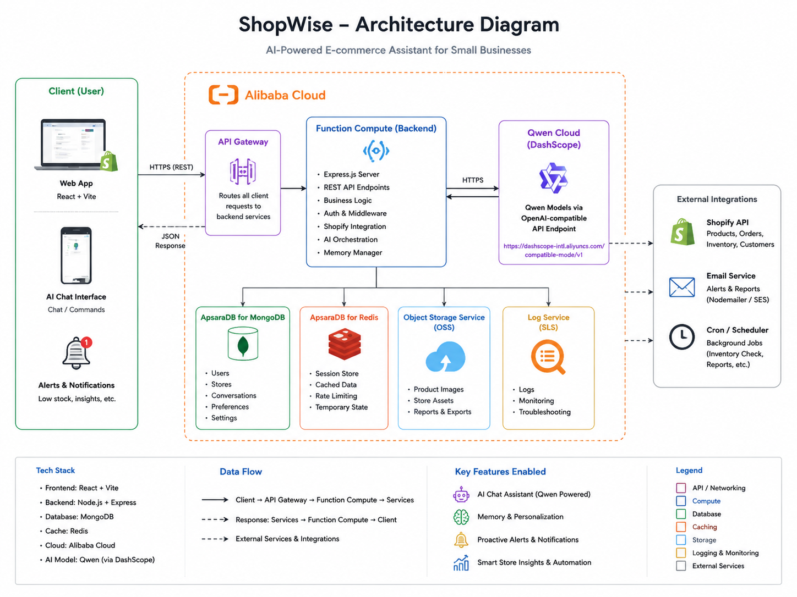

# ShopWise

**The AI business co-pilot that remembers your business and helps you run your online store.**

ShopWise is an AI-powered assistant built for small online businesses and solopreneurs. Instead of simply answering questions, it learns how your business operates over time and helps automate repetitive work while keeping you in control.

Built with **Qwen Cloud** for the **Qwen Cloud Global AI Hackathon 2026**.

---

# The Problem

Running an online shop means wearing many hats every day.

Store owners constantly switch between:

* Answering customer emails
* Managing inventory
* Tracking orders
* Responding to stock questions
* Looking for products that need restocking
* Trying to understand what is happening in the business

Most existing tools solve only one of these problems. They either provide customer support, analytics, or inventory management, but they don't connect everything together.

---

# Our Solutin

ShopWise acts like an intelligent business assistant.

It connects to your online store, understands what is happening, remembers how your business works, and helps you make better decisions.

Instead of waiting for you to ask questions, ShopWise can identify important events, suggest actions, and automate routine tasks while allowing you to approve important decisions.

The longer you use ShopWise, the better it understands your business.

---

# Key Features

## AI Customer Support

ShopWise helps answer customer questions faster.

It can:

* Draft email replies
* Answer product questions
* Check inventory before replying
* Suggest alternative products when something is out of stock
* Keep conversations professional and consistent

---

## Smart Alerts

Instead of making you search through reports, ShopWise watches your business and alerts you when something important happens.

Examples include:

* Products running low on stock
* Popular items selling faster than usual
* Sudden drops in sales
* Repeat customers returning
* Orders that may need attention

The goal is to help you notice important changes before they become problems.

---

## Business Memory

This is what makes ShopWise different.

ShopWise builds a long-term memory of your business.

It remembers things like:

* Your preferred communication style
* Customer history
* Product performance
* Previous conversations
* Business patterns
* Past recommendations

Because of this memory, the AI becomes more helpful over time instead of starting from scratch every session.

---

# How ShopWise Works

1. Connect your online store (Shopify, WooCommerce, or Etsy).
2. ShopWise securely imports your products, orders, and customers.
3. Customer requests are analyzed using Qwen models.
4. Relevant business information is retrieved from memory.
5. ShopWise suggests or performs actions based on your preferences.
6. Every interaction helps improve future recommendations.

---

# Main Pages

### Dashboard

A central overview of your business showing:

* Recent activity
* AI insights
* Alerts
* Business summary

---

### Inbox

Manage customer conversations with AI assistance.

Features include:

* AI-generated replies
* Email drafting
* Conversation history
* Inventory-aware responses

---

### Products

Manage your store inventory.

View:

* Products
* Stock levels
* Low inventory warnings
* Product performance

---

### Customers

View customer information including:

* Purchase history
* Previous conversations
* Customer activity
* AI-generated insights

---

### AI Assistant

Ask ShopWise questions in natural language.

Examples:

* "What should I focus on today?"
* "Which products should I restock?"
* "Show my best customers."
* "Write a reply to this customer."
* "Summarize today's business activity."

---

# Technology

## Frontend

* **Framework**: Next.js (App Router, React 19)
* **Language**: TypeScript
* **State Management**: TanStack Query (React Query) with Server Hydration
* **Styling**: Tailwind CSS v4 + PostCSS
* **Animations**: Framer Motion
* **Iconography**: Lucide React

## Backend

* **Server Framework**: Express.js
* **Runtime**: Node.js
* **Deployment Tooling**: Serverless Devs (`s.yaml`) for Alibaba Cloud

## AI Co-Pilot

* **Model Family**: Alibaba Cloud DashScope Qwen Series (`qwen-plus`, `qwen-max`)
* **SDK Layer**: OpenAI SDK compatible bridge

## Database

* **Fulfillment Data**: PostgreSQL
* **Knowledge Store**: Vector Database (planned for production semantic memory indexing)

---

# Architecture



---

# Why ShopWise Is Different

Many AI assistants only answer questions.

ShopWise goes further by understanding your business over time.

It combines:

* AI customer support
* Business memory
* Smart alerts
* Workflow automation

---

# Deployment

### ⚡ Backend: Alibaba Cloud Function Compute
The backend is structured for instant serverless scaling on **Alibaba Cloud Function Compute (FC)**. 

1. Ensure the Alibaba Cloud Serverless Devs tool is installed (`npm install -g @serverless-devs/s`).
2. Add your environment credentials in `backend/.env`.
3. Build and deploy to Function Compute in one click:
   ```bash
   cd backend
   s deploy
   ```
This provisions your services, handles standard CORS rules, and sets up your HTTP Trigger proxy routing completions.

### 🌐 Frontend: Vercel / Next.js hosting
The frontend is built as a production-grade **Next.js** application.

1. Import the repository in your **Vercel** dashboard.
2. Set the **Root Directory** setting to `frontend`.
3. Add the following environment variables in your Vercel Project Settings:
   * `NEXT_PUBLIC_BACKEND_URL`: *[Your deployed Alibaba Cloud Function Compute HTTP Trigger URL]*
   * `NEXT_PUBLIC_QWEN_API_KEY`: *[Your Alibaba DashScope API Key]*
4. Deploy the project. Next.js will automatically compile and serve pages.

---

# Running Locally

ShopWise is configured as a monorepo workspace for easy local development. You can run both servers with a single command.

### 1. Clone the Repository
```bash
git clone <repository-url>
cd shopwise
```

### 2. Configure Environment Variables

* **Backend**: Create `backend/.env`
  ```env
  PORT=8080
  QWEN_API_KEY=sk-ws-H... # Your Alibaba DashScope API Key
  QWEN_BASE_URL=https://dashscope-intl.aliyuncs.com/compatible-mode/v1
  ```
* **Frontend**: Create `frontend/.env`
  ```env
  NEXT_PUBLIC_BACKEND_URL=http://localhost:8080
  ```

### 3. One-Command Setup & Launch (Recommended)
From the **root** of the workspace directory:
```bash
# Install all root, frontend, and backend packages
npm install && npm run install:all

# Launch both servers concurrently
npm run dev
```

* Backend server will start on [http://localhost:8080](http://localhost:8080)
* Next.js Dev Server will start on [http://localhost:3000](http://localhost:3000)

### 4. Manual Launch (Alternative)
If you prefer to run them in separate terminals:

* **Backend**:
  ```bash
  cd backend && npm install && npm run dev
  ```
* **Frontend**:
  ```bash
  cd frontend && npm install && npm run dev
  ```

---

# Hackathon Track

**Primary Track:** Track 4 – Autopilot Agent

ShopWise demonstrates an AI agent capable of automating business workflows while keeping humans involved in important decisions.

---

# License

This project is released under the MIT License.
